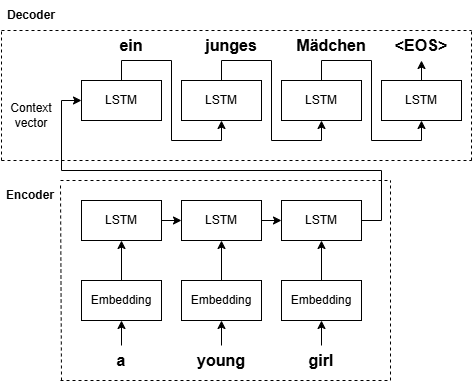
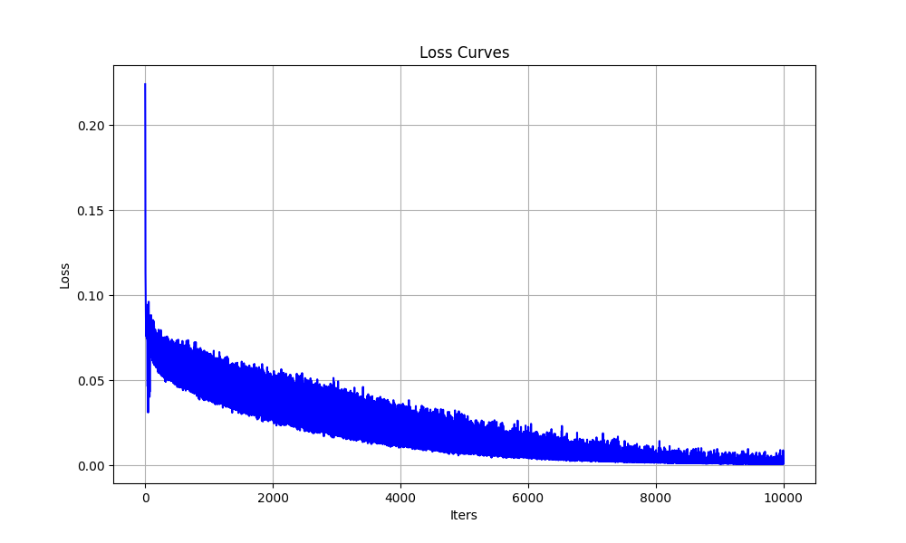
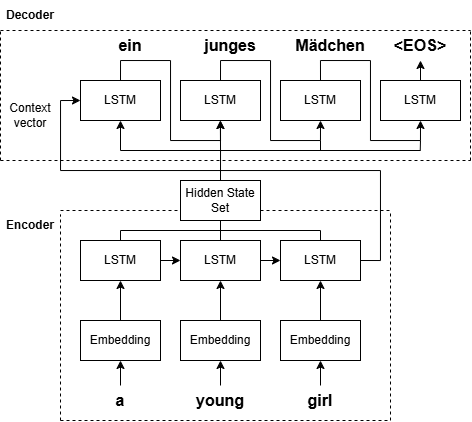
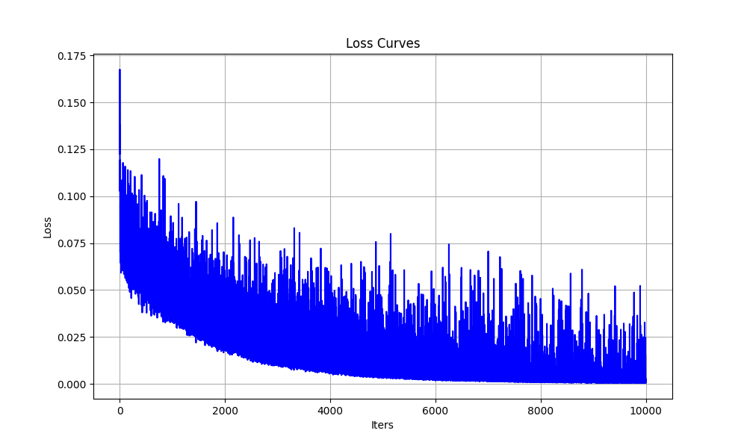

# Encdoer-Decoder Model with Attention
This repository implements both the LSTM Encoder-Deocder Model and the LSTM Encoder-Decoder Model with attention. The models are trained using the [Multi30k en-de dataset](https://huggingface.co/datasets/bentrevett/multi30k). Their impolementations are based on the following papers: the LSTM Encoder-Decoder Model is based on this [paper](https://arxiv.org/abs/1409.3215), and the LSTM Encoder-Decoder model with attention is based on this [paper](https://arxiv.org/abs/1409.0473).

# Requirements
Install the required packages: [datasets](https://pypi.org/project/datasets/), [torch](https://pytorch.org/get-started/locally/), [matplotlib](https://matplotlib.org/stable/install/index.html), [nltk](https://www.nltk.org/install.html)
```bash
pip install -r requirements.txt
```
Additionally, you can utilize your GPU for training via CUDA. However, please note that when using CUDA, you need to ensure that its version is compatible with the version of torch being used.

# Datasets
This repository provides implementations for two datasets: WMT14 fr-en and Multi30k en-de. Data preprocessing can be performed using the data.py script. You can adjust the settings by modifying the variables dataset, src_lang, tgt_lang, and reverse_flag. The dataset variable accepts either "wmt14" or "multi30k". For the src_lang and tgt_lang pairs, the WMT14 dataset supports "en" and "fr" (or vice versa), while the Multi30k dataset supports "en" and "de" (or vice versa). When reverse_flag is set to True, the input sequence is reversed during preprocessing. Additionally, due to the large size of the WMT14 dataset, you can pass a percent parameter (a value between 0.01 and 1) as the second argument to the load_data function to download only a fraction of the dataset.
| | WMT14 | WMT14(1%) | Multi30k |
|:-------:|:-------:|:-------:|:-------:|
| # of sentences | 36M | 326693 | 29000 |
| Vocab size(en) | 380M | 108130 | 10475 |
| Vocab size(fr/de) | 400M | 141797 | 19338 |

# Encoder-Decoder Model
  
The Encoder-Decoder model is implemented based on the [paper](https://arxiv.org/abs/1409.3215). You can train the model using the train.py script. The training configuration can be adjusted by modifying the following variables: set the dataset with pkl_file, src_lang, and tgt_lang; configure the model parameters with max_target_length, hidden_size, num_layers, and batch_size; adjust the training parameters with learning_rate, teacher_forcing_ratio, num_iters, and clip_value; and set debugging parameters with print_every and num_samples. At the end of traning, a random sample of size num_samples is drawn from the validation dataset to devaluate the translation performance. Additionally, the BLEU score is checked, and the training results are visualized using the loss curve and TensorBoard.  

| BLEU Score | 23.97 |
|:-------:|:-------:|

# Encoder-Decoder Model with Attention
  
The Encoder-Decoder Model with attention is implemented based on the [paper](https://arxiv.org/abs/1409.0473). You can train the model using the train_attention_model.py script. The training configuration is similar to that of the previous Encoder-Decoder model, where you can modify the same variables. Additionally, you can adjust the dropout rate via the dropout_p variable. The process after training completion remains the same.  

| BLEU Score | 24.88 |
|:-------:|:-------:|
